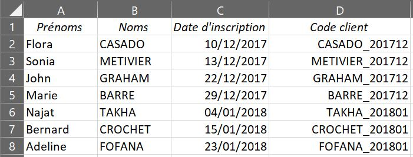

# Other functions

* [VERSION FRANÇAISE](../fr/autres-fonctions.md)
  
## ⚔️ Reminder for calculating percentages

Calculating a percentage is different from calculating a reduction or an increase.

To calculate 10% of €250, multiply by 0.1: <code>=250\*0.1</code> gives €25.

To calculate a 10% increase, multiply by 1.1:  
  <code>=250\*1.1</code> gives €275. *(In other words, 1 + 0.1 is 100 + 10% increase, in this case 250 + 25).*

To calculate a 10% reduction, multiply by 0.90:  
  <code>=250\*0.9</code> gives €225. *(In other words, 0.9 or 1 - 0.1 means 100 - 10% reduction, in this case 250 - 25).*

* * *

## ⚔️ Date functions

As a reminder, in the HOME tab, *Number* section, you can change the format of the selected cell to give it a date format.

If, from a cell in date format, you want to isolate the year or month in another cell, or if you want to convert a serial number into a year/month, use the following functions:

> **=YEAR(** date or numeric value )  
> **=MONTH(** date or numeric value ) 

The same formula applies to **DAY**, **HOUR**, **MINUTE** and **SECOND**.

Here are some other useful date functions:

> **=TODAY()**

Returns today's date. Brackets must remain empty.

> **=DAYS(** date 1 ; date 2 )

Calculates the number of days between two dates.

> **=NB.DAYS.OPEN(** date 1 ; date 2 )

Calculates the number of whole working days between two dates.

* * *

## ⚔️ =TEXT( function

Converts a number into text format. With different acronyms, we can create customized formats to suit our needs.

> **=TEXT(** value to convert ; **"**text format**"** ) 

The two important acronyms to remember when using this formula are <code>#</code> and <code>0</code>:

* A <code>#</code> provides space for an optional number. 
* A <code>0</code> requires the presence of a digit; if there is no digit to convert, a "0" will appear at this point.

Here are a few simple examples:

~~~ =TEXT(A1; "0000") ~~~

This formula converts the value in cell A1 into a text consisting of at least 4 whole numbers.  
If A1 = 9 then the function will display <code>0009</code>. But if A1 = 42.1 then it will display <code>0042</code>.

~~~ =TEXT(A1; "#,00") ~~~

This formula converts the value in cell A1 into text containing a number with at least two decimal places.  
If A1 = 7.8 then the function will display <code>7.80</code>. But if A1 = 0.6789 then it will display <code>.68</code>.

* * *

## ⚔️ The random function

> **=ALEA()**

It generates a random number between 0 and 1. Brackets must remain empty.  
**Please note**, however, that the random number regenerates with each entry. To get around this problem, you can copy the values obtained and perform a special paste operation to extract them from the formula.

> **=ALEA.ENTRE.BORNES(** minimum number ; maximum number )

This variant generates a random <b>integer</b> between two selected bounds.

* * *

## ⚔️ Rounding functions

> **=ARRONDI(** value ; number of decimals )  
> **=ARRONDI.INF(** value ; number of decimal places )  
> **=ARRONDI.SUP(** value ; number of decimals )

These functions are used to round comma-delimited numbers. You can choose to systematically round down or up.

* * *

## ⚔️ =CONCATENER( function

> **=CONCATENER(** value or formula or "text" ; etc. ; etc. ; etc. )

This function allows you to assemble in the same cell a text composed of several elements, such as the value of a cell, the result of a calculation, or a text element.

  

In this example, we wanted to establish an identification code for each customer in column D, based on their registration date and according to a specific text format: <code>NAME\_YEARMONTH</code>. We've used a TEXT() function to ensure that the month is always displayed in two digits.

~~~ =CONCATENER(B2;"\_";YEAR(C2);TEXT(MONTH(C2); "00")) ~~~

* * *

 <a href="mise-en-forme-conditionnelle" target="_self" title="Conditional formatting">  &lt;&lt; Conditional formatting - Previous page  </a> &lt;&lt; - ⚔️ - >> <a href="index" target="_self" title="Index">  Next page - Back to index >>  </a> 

