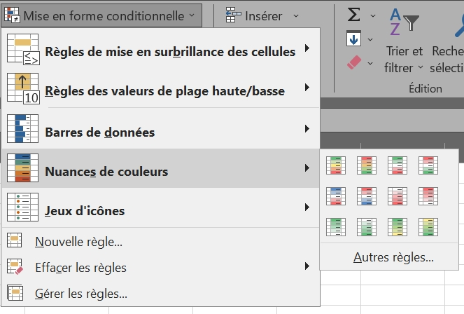

# Customized conditional formatting

* [FRENCH VERSION](../fr/mise-en-forme-conditionnelle.md)
  
## ⚔️ Basics

Conditional formatting is used to highlight differences between values in a table. It is important to select the range to be formatted before setting parameters.

The easiest to use is the color shading function, which, for example, colors smaller values red and larger ones green. In "<b>Manage rules</b>", you can customize formatting rules, particularly for cells containing text.

Formatting sets the relevant cells to a custom format. You can choose to modify:

* Number format (monetary, percentage...)
* Font, size, writing style
* Cell border and fill

* * *

## ⚔️ Rules with formula

Before creating a new formatting rule, make sure to select all the cells that will be affected. You can choose to use a formula to determine for which cells (among the selection) the format will be applied.  

> Formula <code>=$C1=0</code>
>> Applies to <code>=$A$1:$C$10</code>

This formula searches column C for cells equal to zero, and applies a format to all corresponding rows among the 10 selected, from column A to column C.

> Formula =<code>OR($A1="LATE";$B1>500)</code>
>> Applies to <code>=$C:$C</code> 

This formula searches column A for cells containing the text "LATE", or column B for cells with a value greater than 500, and applies a format to all corresponding rows in column C, as long as at least one of the two conditions is met.

* * *

 <a href="tests-logiques" target="self" title="Logic tests">  &lt;&lt; Logic tests - Previous page  </a> &lt;&lt; - ⚔️ - >> <a href="autres-fonctions" target="_self" title="Other functions">  Next page - Other functions >>  </a> 

