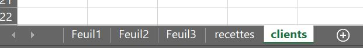
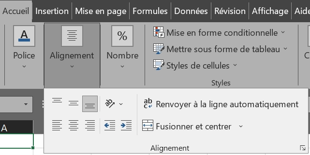
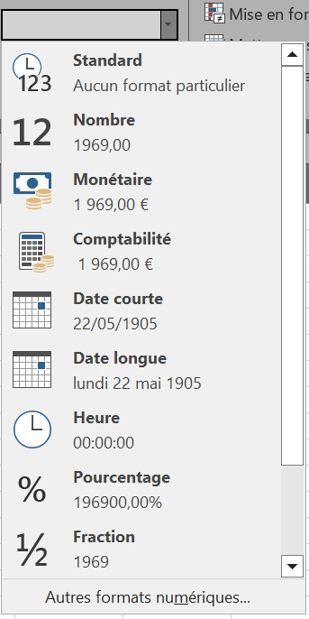
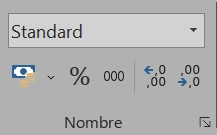
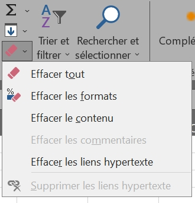
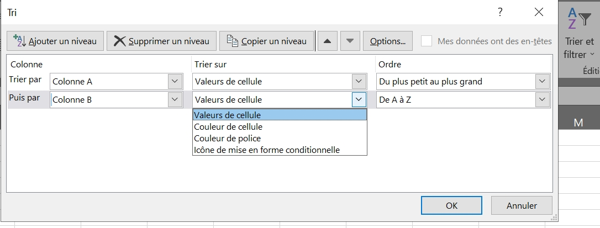
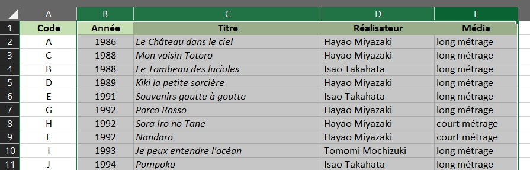

# First steps

* [VERSION FRANÇAISE](../fr/premiers-pas.md)
  
## ⚔️ Some basic formulations 

Formula | Result 
:--------:|--------- 
A:A | All cells in column A 
1:1 | All cells in row 1 
A1 | The cell at the intersection of column 1 and row 1 
AI:A10 | All cells between A1 and A10 
B1;B3;B8 | Only cells B1, B3 and B8 
=C1+C6 | Adds the value of C1 and the value of C6 
=D4\*D5 | Multiplies the value of D4 by the value of D5 
=E7/E2 | Divides the value of E7 by the value of E2 
=F5^2 | Calculates the value of F5 squared 
=SUM(A1:A10) | Adds all cell values between A1 and A10 
=SOMM(A1:A10;B1) | Adds all cell values between A1 and A10, plus B1 
=MOYENNE(A1:A10) | Calculates average of cell values between A1 and A10 
'=E7/E2 | Displays "=E7/E2" as text in cell without producing calculation 
$K1 | Sets column K 
K$1 | Sets row 1 
$K$1 | Sets cell K1 

Once you've entered a formula in a cell, you can **drag** it by clicking on the square at the bottom left of the cell to apply the formula to an entire column/row. The formula will be repeated automatically, but the cells involved in the calculation will change according to the incrementation.

For example, if in D1 we have the following formula:

~~~
=A1+B1-C1
~~~

Drawing the formula over the whole of column D, we get in D7:

~~~
=A7+B7-C7
~~~

Since the shift applies to both rows and columns, if we draw the formula also on column E, we'll get in E7:

~~~
=B7+C7-D7
~~~

To "fix" the column or row in a formula, precede it with a **$** sign. The formula below will increment the rows but will not output columns A, B and C.

~~~
=$A1+$B1-$C1
~~~

Whether drawn horizontally or vertically, this formula will always calculate with the value of cell A1:

~~~
=$A$1+B1
~~~

* * *

## ⚔️ Toolbar: HOME tab

An Excel file is called a workbook, and it can be made up of several sheets, making it easier to navigate between different tables. Sheets can be added to the bottom navigation bar. You can also move them to change their order, or rename them to make them easier to find.

* * *

At the top, in the <b>Home</b> tab, the <i>Alignment</i> section lets you arrange the text in the cell.

Text can be aligned left, right or center; top, bottom or center of the cell.

Text can be oriented in different directions, and automatic line breaks can be set.

* * *

The *Number* section lets you configure the number format: below, the selected cell contains only "1969", and this number will be displayed differently depending on the chosen format.

  You can adjust the number of decimal places to be displayed.  
  For example, if you enter "=10/3" in a cell, it will normally display "3.3333333", but you can set it to display only two digits after the decimal point: "3,33". 
 

 

* * *

In the *Edit* section, you can:

- **Erase all** to empty cells completely
- **Clear formats** to keep content in default format
- **Delete content** to keep format but delete content

* * *

### Sort and filter

To sort a table, select all the cells concerned, so that a column is not sorted on its own without being accompanied by the rest of the information in each row. In this example, the cell selection is shaded and bordered in green, and the rows and columns concerned are darkened.

In "**Customized sorting**", you can set different levels of sorting, useful if certain values are identical in several cells of the same column. You can choose the column, criterion and order in which to sort the table (above: sort by column B, chronologically, in ascending order).

To "**Filter**", select the relevant columns: in this example, columns B, C, D and E are darkened green, meaning that they have been selected in their entirety. When filtering, a small cursor will appear in cells B1, C1, D1 and E1: it displays a drop-down list of filtering possibilities.

> *Note*: sorting changes the order of cells, and filtering hides rows without deleting them.

* * *

 <a href="index" target="_self" title="Index">  &lt;&lt; Back to index - Previous page  </a> &lt;&lt; - ⚔️ - >> <a href="tests-logiques" target="_self" title="Logic tests">  Next page - Logic tests >>  </a> 

