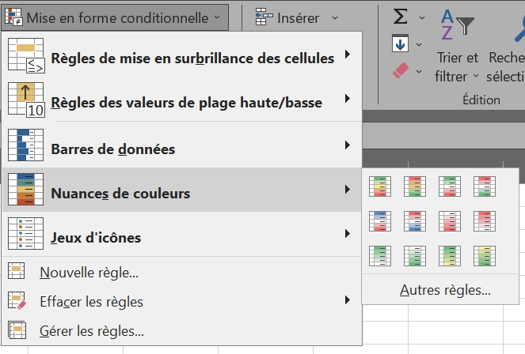

<h1>La mise en forme conditionnelle personnalisée</h1>

<h2><i>Rappel des bases :</i></h2>

  

La mise en forme conditionnelle permet de mettre en évidence les différences de valeurs dans un tableau. La plus facile d’utilisation est celle des nuances de couleurs, qui va par exemple colorer les plus petites valeurs en rouge et les plus grandes en vert. 

Dans « <b>Gérer les règles</b> », on peut personnaliser des règles de mise en forme, notamment pour les cellules contenant du texte. 

----------

<h2>Règles avec formule</h2>

----------

[<< Tests logiques - Page précédente](options-avancees.md) ••• [Page suivante - Autres fonctions >>](autres-fonction.md)
