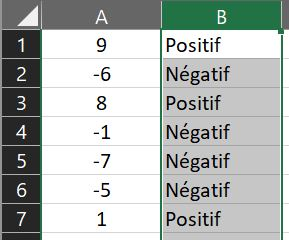
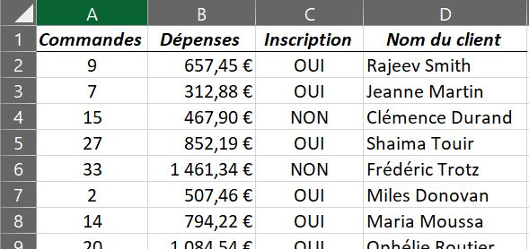

<h1> Tests logiques </h1>

<h2> La fonction =SI( </h2>

Elle permet d'effectuer un test logique. Si le test est vérifié, la cellule affichera une valeur prédéfinie ; si le test échoue, la cellule affichera une autre valeur.

> **=SI(** test logique ; valeur si VRAI ; valeur si FAUX )

------

  

 <i>Exemple 1</i> 

Par exemple, pour vérifier si les cellules de la colonne A sont positives ou négatives, on entrera dans la première cellule de la colonne B : 

~~~
=SI(A1>0;"Positif";"Négatif")
~~~

Il faudra ensuite "tirer" la cellule pour que la formule s'applique sur toutes les cellules de la colonne B.

----------

<h2> Les fonctions =ET( et =OU( </h2>

Ces fonctions renvoient "VRAI" ou "FAUX" selon les conditions remplies. Pour la fonction ET, toutes les conditions doivent être remplies pour valider le test. Pour la fonction OU, une seule des conditions est nécessaire.

> **=ET(** condition 1 ; condition 2 ; etc. )  
> **=OU(** condition 1 ; condition 2 ; etc. )

--------

  

 <i>Exemple 2</i> 

Par exemple, on veut vérifier dans une liste de clients ceux qui ont passé au moins 10 commandes dans la colonne A, <b>et</b> qui ont dépensé plus de 500 € dans la colonne B, <b>et</b> qui ont validé leur inscription dans la colonne C. 

~~~
=ET(A1>=10;B1>500;C1="OUI")
~~~

Si on veut vérifier les clients qui n'ont validé aucune de ces conditions, on utilisera cette formule : 

~~~
=OU(A1<10;B1<500;C1="NON")
~~~

----------

<h2> Les fonctions =SI( imbriquées </h2>

On peut imbriquer dans une fonction SI des formules ET/OU afin de créer des tests plus complexes qui dépendent d'un plus grand nombre de conditions. Ainsi, on utilise la vérification de conditions en "VRAI" ou "FAUX" des fonctions ET/OU pour programmer une fonction SI adaptée.

> =SI(ET( condition 1 ; condition 2 ; etc. ) ; valeur si **tout est VRAI** ; valeur si **1 FAUX** )  
> =SI(OU( condition 1 ; condition 2 ; etc. ) ; valeur si **1 VRAI** ; valeur si **tout est FAUX** )

Dans l'exemple 1, si on veut que les clients ayant rempli **toutes** les conditions aient une réduction de 25% sur leur commande en colonne D, on entrera la formule suivante : 

~~~
=SI(ET(A1>=10;B1>500;C1="OUI");D1*0,75;D1)
~~~

Si on veut que les clients remplissant **au moins une** condition aient une réduction de 10%, on utilisera cette formule : 

~~~
=SI(OU(A1<10;B1<500;C1="NON");D1;D1*0,90)
~~~

On peut aussi imbriquer une fonction SI dans une fonction SI pour que le test logique ait trois possibilités de résultats ou plus.

> =SI( test logique X ; **valeur 1** si VRAI ; SI( test logique Y ; **valeur 2** si VRAI ; **valeur 3** si FAUX ))

Dans l'exemple 2, pour vérifier si les cellules de la colonne A sont positives, négatives, ou égales à zéro, on entrera dans la première cellule de la colonne B : 

~~~
=SI(A1>0;"Positif";SI(A1=0;"Zéro";"Négatif"))
~~~

-------

 <a href="premiers-pas.md" target="self" title="Premiers pas"><< Premiers pas - Page précédente</a> << • • • >> <a href="mise-en-forme-conditionnelle.md" target="self" title="Mise en forme conditionnelle">Page suivante - Mise en forme conditionnelle >></a> 

