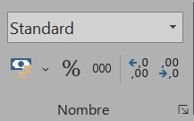

# Premiers pas
  ## ⚔️ Quelques formulations basiques 

Formule | Résultat
------------------
<code>A:A</code> | Toutes les cellules de la colonne A
<code>1:1</code> | Toutes les cellules de la ligne 1
<code>A1</code> | La cellule située au croisement entre la colonne 1 et la ligne 1
<code>AI:A10</code> | Toutes les cellules comprises entre A1 et A10
<code>B1;B3;B8</code> | Seulement les cellules B1, B3 et B8
<code>=C1+C6</code> | Additionne la valeur de C1 et la valeur de C6
<code>=D4*D5</code> | Multiplie la valeur de D4 par la valeur de D5
<code>=E7/E2</code> | Divise la valeur de E7 par la valeur de E2
<code>=F5^2</code> | Calcule la valeur de F5 au carré
<code>=SOMME(A1:A10)</code> | Additionne toutes les valeurs des cellules comprises entre A1 et A10
<code>=SOMME(A1:A10;B1)</code> | Additionne toutes les valeurs des cellules comprises entre A1 et A10, plus celle de B1
<code>=MOYENNE(A1:A10)</code> | Calcule la moyenne des valeurs des cellules comprises entre A1 et A10
<code>'=E7/E2</code> | Affiche « =E7/E2 » en texte dans la cellule sans produire le calcul
<code>$K1</code> | Fixe la colonne K
<code>K$1</code> | Fixe la ligne 1
<code>$K$1</code> | Fixe la cellule K1 

Une fois la formule entrée dans une cellule, on peut la **tirer** en cliquant sur le carré en bas à gauche de la cellule pour appliquer la formule sur toute une colonne/ligne. La formule sera répétée automatiquement, mais les cellules concernées par le calcul vont changer en fonction de l'incrémentation.

Par exemple, si en D1 on a la formule suivante :

~~~
=A1+B1-C1
~~~

Alors en tirant la formule sur toute la colonne D, on aura en D7 :

~~~
=A7+B7-C7
~~~

Puisque le décalage s'applique à la fois aux lignes et au colonnes, si on tire la formule également sur la colonne E, on aura en E7 :

~~~
=B7+C7-D7
~~~

Pour « fixer » la colonne ou la ligne dans une formule, il faut la faire précéder d'un signe **$**.
La formule ci-dessous incrémentera les lignes mais ne sortira pas des colonnes A, B et C.

~~~
=$A1+$B1-$C1
~~~

Qu'elle soit tirée horizontalement ou verticalement, cette formule calculera toujours avec la valeur de la cellule A1 :

~~~
=$A$1+B1
~~~

* * *

## ⚔️ Barre d'outils : onglet ACCUEIL

Un fichier Excel s’appelle un classeur, et il peut être composé de plusieurs feuilles, ce qui facilite la navigation entre différents tableaux. On peut ajouter des feuilles sur la barre de navigation, en bas. Il est aussi possible de les déplacer pour changer leur ordre, ou de les renommer pour s’y retrouver plus facilement.

* * *

En haut, dans l'onglet <b>Accueil</b>, la partie <i>Alignement</i> permet d'ordonner le texte dans la cellule.

On peut aligner le texte à gauche, à droite, ou au milieu ; en haut, en bas ou au centre de la cellule.

On peut orienter le texte dans différentes directions, et paramétrer un retour à la ligne automatique.

* * *

La partie *Nombre* permet de configurer le format de nombre : ci-dessous, la cellule sélectionnée contient seulement « 1969 » et ce nombre s'affichera différemment en fonction du format choisi.

  
  On peut ajuster la quantité de nombres après la virgule à afficher.  
  Par exemple, si on entre dans une cellule « =10/3 », elle s'affiche normalement « 3,3333333 », mais on peut la paramétrer pour qu'elle affiche seulement deux chiffres après la virgule : « 3,33 ». 

* * *

Dans la partie *Édition*, on peut :

- **Effacer tout** pour vider complètement les cellules
- **Effacer les formats** pour garder le contenu avec un format par défaut
- **Effacer le contenu** pour garder le format mais supprimer le contenu

* * *

### Trier et filtrer

Pour trier un tableau, bien sélectionner toutes les cellules concernées, afin qu’une colonne ne soit pas triée toute seule sans être accompagnée du reste des informations de chaque ligne. Sur cet exemple, la sélection de cellules est grisée et bordée de vert, et les lignes et colonnes concernées sont foncées.

Dans « **Tri personnalisé** », on peut paramétrer les différents niveaux de tri, utiles si certaines valeurs sont identiques dans plusieurs cellules de la même colonne. On peut choisir la colonne, le critère et l’ordre selon lesquels trier le tableau (ci-dessus : tri selon la colonne B, chronologiquement, par ordre croissant).

Pour « **Filtrer** », il faut sélectionner les colonnes concernées : sur cet exemple, on voit que les colonnes B, C, D et E sont foncées en vert, ce qui signifie qu’elles ont été sélectionnées dans leur totalité. En filtrant, un petit curseur va apparaître dans les cellules B1, C1, D1 et E1 : il permet l’affichage d’une liste déroulante des possibilités de filtrage.

> *Remarque* : un tri modifie l’ordre des cellules, et un filtre dissimule des lignes sans les supprimer.

* * *

 <a href="index" target="_self" title="Index">  << Retour à l'index - Page précédente  </a> << • ⚔️ • >> 
  <a href="tests-logiques" target="_self" title="Tests logiques">  Page suivante - Tests logiques >>  </a> 

