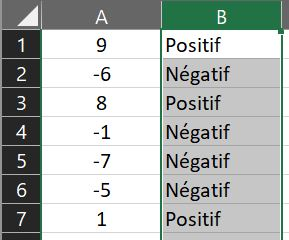
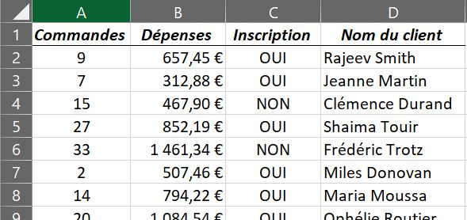

# Les tests logiques 

## ⚔️ La fonction =SI( 

Elle permet d'effectuer un test logique. Si le test est vérifié, la cellule affichera une valeur prédéfinie ; si le test échoue, la cellule affichera une autre valeur.

> **=SI(** test logique ; valeur si VRAI ; valeur si FAUX )

  

 <i>Exemple 1</i> 

  

 *Exemple 1* 

Par exemple, pour vérifier si les cellules de la colonne A sont positives ou négatives, on entrera dans la première cellule de la colonne B :

~~~
=SI(A1>0;"Positif";"Négatif")
~~~

Il faudra ensuite "tirer" la cellule pour que la formule s'applique sur toutes les cellules de la colonne B.

  

 <i>Exemple 2</i> 

Je veux savoir si mon semestre est validé. Pour cela, je calcule ma moyenne : c'est mon test logique. Deux résultats sont possibles : soit j'ai la moyenne, donc le test est vérifié et je valide mon semestre (c'est la valeur si VRAI), soit je n'ai pas la moyenne, donc le test échoue et je ne valide pas mon semestre (c'est la valeur si FAUX).

~~~
=SI(MOYENNE(A1;A10)>=10;"Semestre validé";"Semestre non validé")
~~~

## ⚔️ Les fonctions =ET( et =OU( 

Ces fonctions renvoient "VRAI" ou "FAUX" selon les conditions remplies. Pour la fonction ET, toutes les conditions doivent être remplies pour valider le test. Pour la fonction OU, une seule des conditions est nécessaire.

> **=ET(** condition 1 ; condition 2 ; etc. ) 
> **=OU(** condition 1 ; condition 2 ; etc. ) 

  

 <i>Exemple 3</i> 

Par exemple, on veut vérifier dans une liste de clients ceux qui ont passé au moins 10 commandes dans la colonne A, <b>et</b> qui ont dépensé plus de 500 € dans la colonne B, <b>et</b> qui ont validé leur inscription dans la colonne C.

~~~
=ET(A1>=10;B1>500;C1="OUI")
~~~

Si on veut vérifier les clients qui n'ont validé aucune de ces conditions, on utilisera cette formule :

~~~
=OU(A1<10;B1<500;C1="NON")
~~~

On peut imbriquer dans une fonction SI des formules ET/OU afin de créer des tests plus complexes qui dépendent d'un plus grand nombre de conditions. Ainsi, on utilise la vérification de conditions en "VRAI" ou "FAUX" des fonctions ET/OU pour programmer une fonction SI adaptée.

> =SI(ET( condition 1 ; condition 2 ; etc. ) ; valeur si **tout est VRAI** ; valeur si **UN FAUX** ) 
> =SI(OU( condition 1 ; condition 2 ; etc. ) ; valeur si **UN VRAI** ; valeur si **tout est FAUX** )

Dans l'exemple 3, si on veut que seuls les clients ayant rempli <b>toutes</b> les conditions aient une réduction de 25% sur leur commande en colonne E, on entrera la formule suivante : 

~~~
=SI(ET(A1>=10;B1>500;C1="OUI");E1*0,75;E1)
~~~

Si on veut que tous les clients remplissant <b>au moins une</b> condition aient une réduction de 10%, on utilisera cette formule : 

~~~
=SI(OU(A1<10;B1<500;C1="NON");E1;E1*0,90)
~~~

 <b>Si on veut que le test logique ait trois possibilités de résultats ou plus, il y a plusieurs solutions : </b> 
 
  

## ⚔️ La fonction =SI( imbriquée

On peut imbriquer une fonction SI dans une autre fonction SI pour créer un rapport de subordination entre plusieurs tests logiques.

> =SI( test logique X ; SI( test logique Y ; **valeur 1** si Y VRAI ; **valeur 2** si Y FAUX ) ; **valeur 3** si X FAUX )

Ici, on effectue un premier test logique (X). S'il se vérifie, on effectue un deuxième test logique (Y) pour différencier deux résultats. Si par contre il échoue, on renvoie un troisième résultat.

Dans l'exemple 1, si on veut que les clients inscrits aient une réduction de 25% sur leur commande en colonne E s'ils ont dépensé plus de 500€ et une réduction de 15% sinon, et si on veut que les clients non-inscrits aient une réduction de 5% quel que soit le montant qu'ils aient dépensé, on écrira :

~~~
=SI(C1="OUI";SI(B1>500;E1*0;75;E1*0,85);E1*0,95)
~~~

## ⚔️ La fonction =SI.CONDITIONS( 

Si on veut effectuer différents tests logiques avec un grand nombre de résultats possibles, on utilisera cette fonction :

> =SI.CONDITIONS( test logique X ; **valeur 1** si VRAI ; test logique Y ; **valeur 2** si VRAI ; test logique Z ; **valeur 3** si VRAI )

Dans l'exemple 3, pour vérifier si les cellules de la colonne A sont positives, négatives, ou égales à zéro, on entrera dans la première cellule de la colonne B : 

<pre>=SI.CONDITIONS(A1>0;"Positif";A1=0;"Zéro";A1<0;"Négatif")</pre>

## ⚔️ La fonction =SI.MULTIPLE( 

Il existe une autre fonction SI, qui va tester la valeur d'une cellule en particulier. Elle fonctionne par paires de valeurs et de résultats pour chaque possibilité, avec un résultat par défaut.

> =SI.MULTIPLE( cellule à vérifier ; valeur 1 ; résultat 1 ; valeur 2 ; résultat 2 ; valeur 3 ; résultat 3 ; résultat par défaut )

Par exemple, on a une liste d'athlètes dans la colonne A et on veut identifier les gagnants de la compétition :

~~~
=SI.MULTIPLE(A1;1;"Médaille d'or";2;"Médaille d'argent";3;"Médaille de bronze";"Hors podium")
~~~

* * *

 <a href="premiers-pas" target="_self" title="Premiers pas">  << Premiers pas - Page précédente  </a> << • ⚔️ • >> <a href="mise-en-forme-conditionnelle" target="_self" title="Mise en forme conditionnelle">  Page suivante - Mise en forme conditionnelle >>  </a> 

